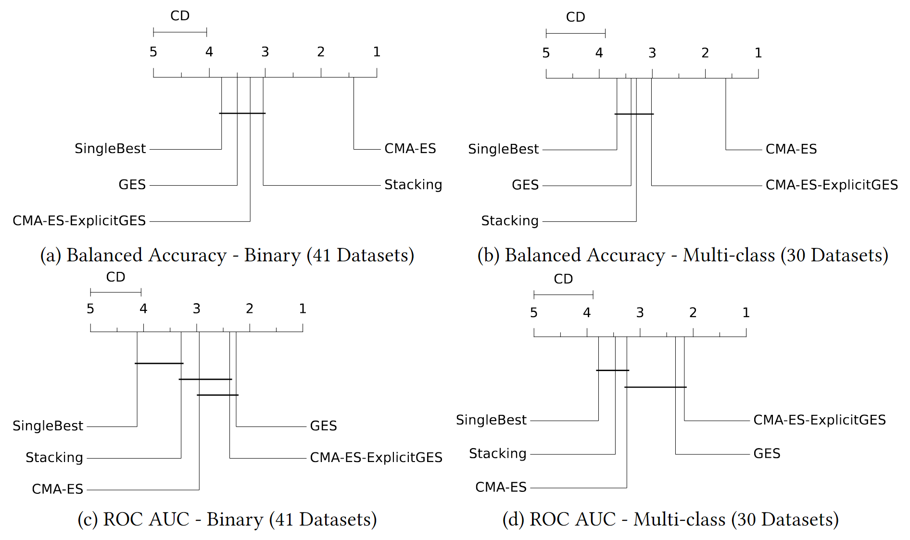

# [Reproducibility Repository] CMA-ES for Post Hoc Ensembling in AutoML: A Great Success and Salvageable Failure

This repository is related to the paper "CMA-ES for Post Hoc Ensembling in AutoML: A Great Success and Salvageable
Failure".
It provides the code used to generate and save the base models' data and run the ensemble methods on the base models'
data.
This README provides a short overview of the code base before showing how to reproduce our results.

We ran the scripts provided in this repository in a highly parallel manner across specific hardware.
We do not provide the code for parallelization in this repository as it is hard-coded and designed for the used hardware
and does not translate to other systems.
Instead, we provide a minimal example and all information necessary to run the code and leave it to the user to
parallelize the scripts if needed.

### Paper TL;DR
Using CMA-ES for Post Hoc Ensembling in AutoML and avoiding overfitting for ROC AUC by normalization. 

### Paper Abstract
Many state-of-the-art automated machine learning (AutoML) systems use greedy ensemble selection (GES) by Caruana et
al. (2004) to ensemble models found during model selection post hoc. Thereby, boosting predictive performance and likely
following Auto-Sklearn 1's insight that alternatives, like stacking or gradient-free numerical optimization, overfit.
Overfitting in Auto-Sklearn 1 is much more likely than in other AutoML systems because it uses only low-quality
validation data for post hoc ensembling. Therefore, we were motivated to analyze whether Auto-Sklearn 1's insight holds
true for systems with higher-quality validation data. Consequently, we compared the performance of covariance matrix
adaptation evolution strategy (CMA-ES), state-of-the-art gradient-free numerical optimization, to GES on the 71
classification datasets from the AutoML benchmark for AutoGluon. We found that Auto-Sklearn's insight depends on the
chosen metric. For the metric ROC AUC, CMA-ES overfits drastically and is outperformed by GES -- statistically
significantly for multi-class classification. For the metric balanced accuracy, CMA-ES does not overfit and outperforms
GES significantly. Motivated by the successful application of CMA-ES for balanced accuracy, we explored methods to stop
CMA-ES from overfitting for ROC AUC. We propose a method to normalize the weights produced by CMA-ES, inspired by GES,
that avoids overfitting for CMA-ES and makes CMA-ES perform better than or similar to GES for ROC AUC.

## Results Teaser

The goal of _post hoc ensembling_ for AutoML is to aggregate a pool of base models consisting of all models that are
trained and validated during an AutoML system's model selection or a subset thereof.

In our paper, we proposed to use `CMA-ES` for post hoc ensembling in AutoML. 
We compared `CMA-ES` to `GES`, `Stacking` with a linear model, and the single best model (no ensembling) `SingleBest`.
Additionally, we proposed a novel normalization method for CMA-ES to avoid overfitting for ROC AUC, denoted as `CMA-ES-ExplicitGES`.

Below are the Critical Differences (CD) plots for binary and multi-class classification for the 71 dataset from 
the AutoML benchmark. The plots are additionally split for balanced accuracy and ROC AUC, because these represent different 
optimization problems. Methods connected by a vertical bar are not significantly different. The axis at the top and 
the line connected to a method's name indicate the mean rank of the method. The lower the rank, the better the method.



For more details and results, see our paper (links can be found at the bottom of the README).
## Data

Parts of our code generated data that we used in our paper.
To access the data, please see: [DOI](https://doi.org/10.6084/m9.figshare.23609361).

## Content Overview

* `assembled_autogluon`: Contains the code to run AutoGluon on the dataset from the AutoML benchmark and save data for
  base models.
* `assembled_ensemlbes`: Contains all code related to running ensemble methods.
* `benchmark`: contains example data and is used as output directory for the minimal example
* `conf`: Contains the all setup data used to run the scripts
* `evaluation`: contains the raw results and the code to produce the plots and evaluation results of the paper
* `util`: contains scripts to get data related to the project

## Reproducibility Workflow - Minimal Example

The following provides a minimal example for each part of the code that we created for this publication.
Each part can be done independently and does not require a previous part to be run first.

### Reproducing: Generating Base Model with AutoGluon

Please refer to `./assembled_autogluon/README.md` for details.

### Reproducing: Running Post Hoc Ensembling Methods

Please refer to `./assembled_ensembles/README.md` for details.

### Reproducing: Plots and Evaluations

Please refer to `./benchmark/evaluation/README.md` for details.

## Relevant Publication

If you use our code or the data produced by our code in scientific publications, we would appreciate citations.

**CMA-ES for Post Hoc Ensembling in AutoML: A Great Success and Salvageable Failure**,
_Lennart Purucker, Joeran Beel_, _Second International Conference on Automated Machine Learning, 2023_.

Link to publication: OpenReview and arXiv (**_TBA_**)

Link to teaser video: **_TBA_**

Link to full video: **_TBA_**

```
@inproceedings{TBA}
```
